# Hash table optimization
This is a case study on how defining constraints helps boost performance. 

The resulting performance gained with the improvements observed below is 125% compared to -03.

## Table of contents
* [Background](#background)
* [Abstract](#abstract)
* [Version 0](#version-0)
  1. [elfHash](#1-elfhash)
  2. [operator== for hash table entires](#2-operator-for-hash-table-entries)
  3. [__strcmp_AVX2](#3-__strcmp_avx2)
  4. [findNodeByValue for doubly linked lists](#4-findnodebyvalue-for-doubly-linked-lists)
* [Version 1](#version-1)
* [Version 2](#version-2)
* [Version 3](#version-3)
* [Conclusion](#conclusion)

## Background
This work was handed out by [@ded32](https://github.com/ded32) as part of the "Computer Architecture" course held in MIPT.

## Abstract
We need to implement a chained string-hash table with linked lists and optimize it for performance.

Our input data consists of a set of uniformly distributed English [words](words.txt?raw=true): we load them into our hash table and then perform a signifcant amount of random lookups.

Performance is measured and analyzed with [Intel® VTune™ Profiler](https://software.intel.com/content/www/us/en/develop/tools/oneapi/components/vtune-profiler.html).

The executable is compiled on a Linux machine with clang++ and the following flags:
```Makefile
-O3
```

## [Version 0](v0)
This was the inital generalized implementation, with no data constraints defined.

The elapsed time was:

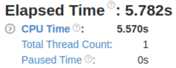

The top performance hotspots were:

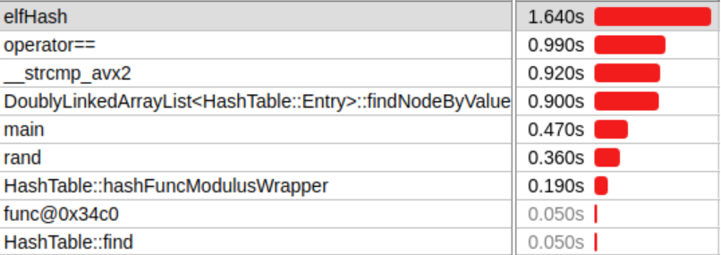

Let us examine the hotspots.

### 1. elfHash 

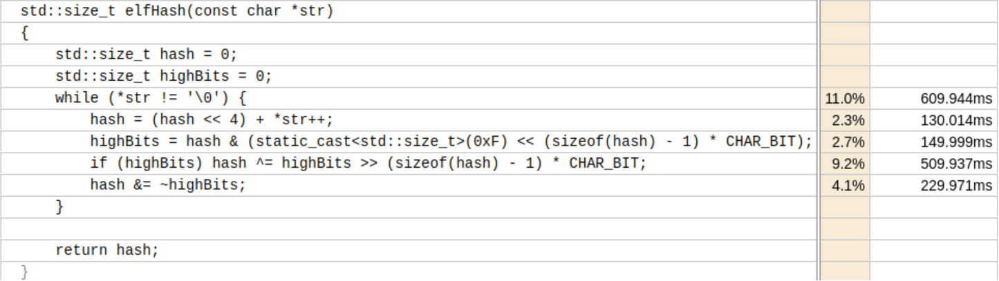
We see that the hash function creates a performance bottleneck: we should consider using Intel's intrinsic crc32 hash function. The only drawback is that we would need to loop over our strings (on size of dword, word, etc.) in order to hash them.

### 2. operator== for hash table entries

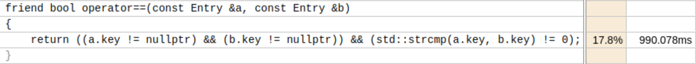
Our comparison operator implies comparing strings of arbitrary length: we should also consider using Intel's AVX2 intrinsic for strings comparison. The drawback
here would be the remaining arbitrary length of the strings, which does not permit us to make any more efficient optimizations.

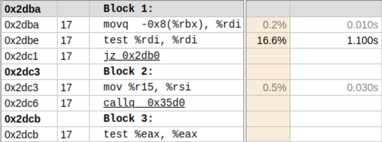

### 3. __strcmp_avx2

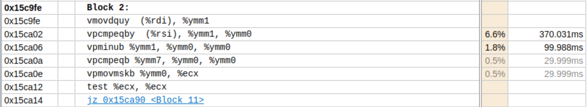

This is the complete source code which I discovered in libc sources (due to lack of debug symbols for libc):
```asm
      movl        %edi, %eax
      xorl        %edx, %edx
      ; Make %ymm7 all zeros in this function.
      vpxor       %ymm7, %ymm7, %ymm7
      orl         %esi, %eax
      andl        $(PAGE_SIZE - 1), %eax
      cmpl        $(PAGE_SIZE - (VEC_SIZE * 4)), %eax
      jg L(cross_page)
      ; Start comparing 4 vectors.
      vmovdqu     (%rdi), %ymm1
      VPCMPEQ     (%rsi), %ymm1, %ymm0
      VPMINU      %ymm1, %ymm0, %ymm0
      VPCMPEQ     %ymm7, %ymm0, %ymm0
      vpmovmskb   %ymm0, %ecx
      testl       %ecx, %ecx
      je          L(next_3_vectors)
```
Apparently, libc has its own intrinsic for string comparison which heavily uses AVX2.

### 4. findNodeByValue for doubly linked lists

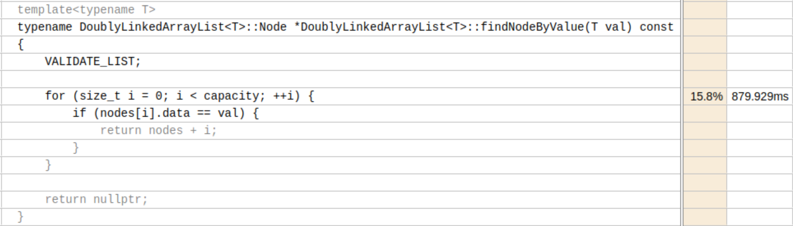
This is a straightforward implementation of linear linked list search: nothing really we can do to optimize this better than what the compiler does for us.

## [Version 1](v1)
Summing up the results from the initial version and analysing our dataset, we naturally come up with the idea to restrict the size of the strings we hash to a size that fits well for the optimizations we keep in mind, thus defining the following constraint on our input data:

```C++
static const std::size_t StringSize = CHAR_BIT * sizeof(unsigned long long);
typedef char String[StringSize];
```

This allows us to calculate hashes in precisely one (!) instruction cycle by using the [_mm_crc32_u64](https://software.intel.com/sites/landingpage/IntrinsicsGuide/#text=crc32) intrinsic. Also, now we can compare two strings just by casting them to 64-bit integers.

Supprisingly, the results were opposite — I received a performance degrade:

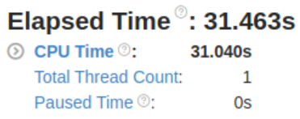

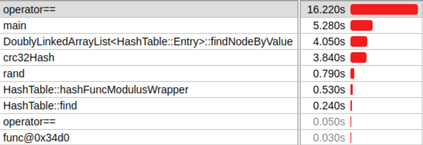

Let's examine the performance and assembly of operator== for hash table entries:

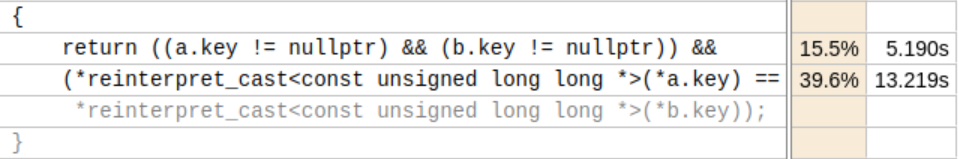

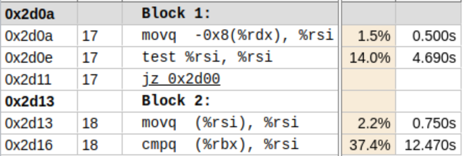

This disassembly was not sufficient, so I used the [Compiler Explorer](https://godbolt.org) tool to reproduce the disassembly:
```asm
      mov     rax, qword ptr [rdi]
        test    rax, rax
        je      .LBB1_4
        mov     rcx, qword ptr [rsi]
        test    rcx, rcx
        je      .LBB1_4
        mov     rax, qword ptr [rax]
        cmp     rax, qword ptr [rcx]
        sete    al
        ret
.LBB1_4:
        xor     eax, eax
        ret
```

## [Version 2](v2)
Obviously, I decided to revert the implementation of the operator== for hash table entries to the inital one to see if it removes the resulted performance
bottleneck:

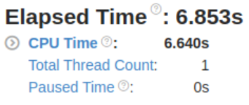

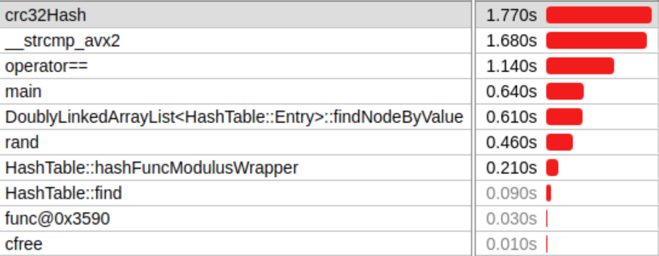

And it actually did... Thinking of where the problem lies and how could string comparison (even considering the libc AVX2 intrinsic optimization) possibly be
more efficient than explicit number comparison, I thought of how arbitrary data can be tested on equality based on its binary representation: the bitwise XOR 
appeared to me to be the key, even though I did not think that, clearly, the equality operator must be already by design equivalent to biwise XOR.

## [Version 3](v3)
Anyways, I changed the equality operator accordingly:

```C++
friend bool operator==(const Entry &a, const Entry &b)
{
    return ((a.key != nullptr) && (b.key != nullptr)) &&
    !((*reinterpret_cast<const unsigned long long *>(*a.key) ^
      *reinterpret_cast<const unsigned long long *>(*b.key)));
}
```

The results were as follows:

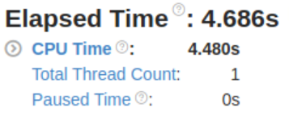

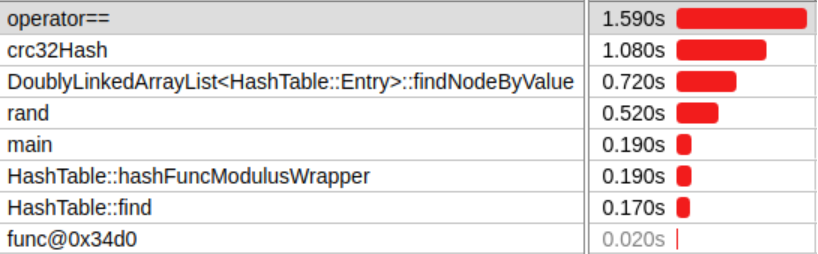

Wow! Turns out, this, at first glance, nonsense "optimization" did the trick. But let's try to figure out what really happend under the compiler hood and analyze the disassembly (once again reproduced using the [Compiler Explorer](https://godbolt.org) tool).

```asm
        mov     rax, qword ptr [rdi]
        test    rax, rax
        je      .LBB1_4
        mov     rcx, qword ptr [rsi]
        test    rcx, rcx
        je      .LBB1_4
        mov     rax, qword ptr [rax]
        cmp     rax, qword ptr [rcx]
        sete    al
        ret
.LBB1_4:
        xor     eax, eax
        ret
```

The [disassemblies](https://godbolt.org/z/o5W6rqcn5) completely match: looks like we have discovered a bug in the clang++ optimizer — at least I have no other 
reasonable interpretation.

## Conclusion
The performance of the final version compared to that of the initial one is shown below.

Elapsed time difference:

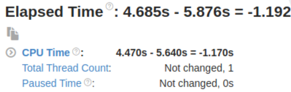

CPU time difference:

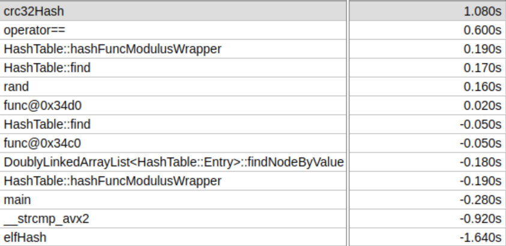

The Dedinsky number for the resulting optimization: 1250.

The definition of a constraint on the hash table's input data gave us the oppurtunity to perform optimizations resulting in a 125% performance gain compared to
-03.

A bug has been discovered in the clang++ optimizer, and I will try to investigate it further in the future.
